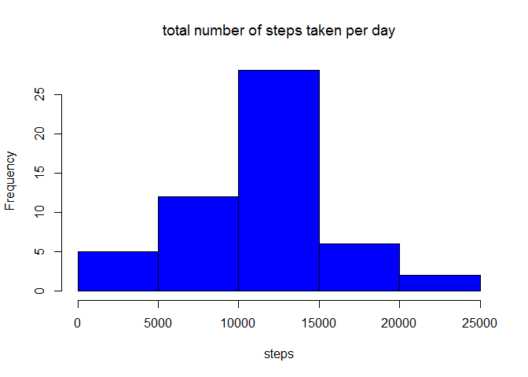
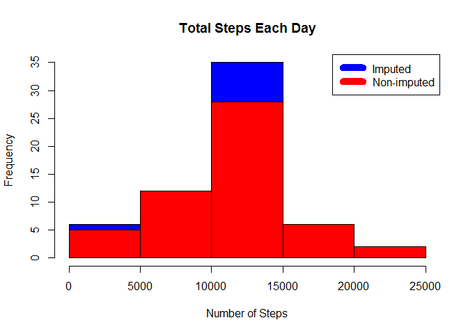

# Reproducible Research: Peer Assessment 1


## Loading and preprocessing the data

I cloned the repository, then i will unzip and read the csv file 

```r
## Unzip Data

unzip("C:/Users/Ahmed/Desktop/DataScienceSpecialization/RepData_PeerAssessment1/activity.zip", exdir = "C:/Users/Ahmed/Desktop/DataScienceSpecialization/RepData_PeerAssessment1")

#read data
data <- read.csv("C:/Users/Ahmed/Desktop/DataScienceSpecialization/RepData_PeerAssessment1/activity.csv")
```


## What is mean total number of steps taken per day?
For this part of the assignment, you can ignore the missing values in the dataset.
- Calculate the total number of steps taken per day
- Make a histogram of the total number of steps taken each day
- Calculate and report the mean and median of the total number of steps taken per day


```r
# total number of steps taken per day:
library(dplyr)
```

```
## Warning: Installed Rcpp (0.12.10) different from Rcpp used to build dplyr (0.12.11).
## Please reinstall dplyr to avoid random crashes or undefined behavior.
```

```
## 
## Attaching package: 'dplyr'
```

```
## The following objects are masked from 'package:stats':
## 
##     filter, lag
```

```
## The following objects are masked from 'package:base':
## 
##     intersect, setdiff, setequal, union
```

```r
library(AggregateR)
total.steps <- summarise(group_by(data, date), steps=sum(steps))
hist(total.steps$steps, main = expression("total number of steps taken per day"),xlab = "steps", col = "blue")
```

<!-- -->

```r
meansteps <- mean(total.steps$steps, na.rm = TRUE)
mediansteps <- median(total.steps$steps, na.rm = TRUE)
```
the mean is 1.0766189\times 10^{4} and median is 10765.

## What is the average daily activity pattern?
- Calculate average steps for each interval for all days.
- Plot the Average Number Steps per Day by Interval.
- Find interval with most average steps.


```r
steps_by_interval <- aggregate(steps ~ interval, data, mean)

plot(steps_by_interval$interval,steps_by_interval$steps, type="l", xlab="Interval", ylab="Number of Steps",main="Average Number of Steps per Day by Interval")
```

<!-- -->

```r
max_interval <- steps_by_interval[which.max(steps_by_interval$steps),1]
```
The 5-minute interval, on average across all the days in the data set, containing the maximum number of steps is 835

## Imputing missing values
Missing data needed to be imputed. Only a simple imputation approach was required for this assignment. 
Missing values were imputed by inserting the average for each interval. Thus, if interval 10 was missing on 10-02-2012, the average for that interval for all days (0.1320755), replaced the NA. 

```r
incomplete <- sum(!complete.cases(data))
imputed_data <- transform(data, steps = ifelse(is.na(data$steps), steps_by_interval$steps[match(data$interval, steps_by_interval$interval)], data$steps))
```

Zeroes were imputed for 10-01-2012 because it was the first day and would have been over 9,000 steps higher than the following day, which had only 126 steps. NAs then were assumed to be zeros to fit the rising trend of the data. 

```r
imputed_data[as.character(imputed_data$date) == "2012-10-01", 1] <- 0
```

Recount total steps by day and create Histogram. 

```r
steps_by_day_i <- aggregate(steps ~ date, imputed_data, sum)
hist(steps_by_day_i$steps, main = paste("Total Steps Each Day"), col="blue", xlab="Number of Steps")

#Create Histogram to show difference. 
hist(total.steps$steps, main = paste("Total Steps Each Day"), col="red", xlab="Number of Steps", add=T)
legend("topright", c("Imputed", "Non-imputed"), col=c("blue", "red"), lwd=10)
```

<!-- -->

Calculate new mean and median for imputed data. 

```r
rmean.i <- mean(steps_by_day_i$steps)
rmedian.i <- median(steps_by_day_i$steps)
```

Calculate difference between imputed and non-imputed data.

```r
mean_diff <- rmean.i - meansteps
med_diff <- rmedian.i - mediansteps
```

Calculate total difference.

```r
total_diff <- sum(steps_by_day_i$steps) - sum(total.steps$steps)
```
* The imputed data mean is 1.0589694\times 10^{4}
* The imputed data median is 1.0766189\times 10^{4}
* The difference between the non-imputed mean and imputed mean is -176.4948964
* The difference between the non-imputed mean and imputed mean is 1.1886792
* The difference between total number of steps between imputed and non-imputed data is NA. Thus, there were NA more steps in the imputed data.


## Are there differences in activity patterns between weekdays and weekends?
Created a plot to compare and contrast number of steps between the week and weekend. There is a higher peak earlier on weekdays, and more overall activity on weekends.  

```r
weekdays <- c("Monday", "Tuesday", "Wednesday", "Thursday", 
              "Friday")
imputed_data$dow = as.factor(ifelse(is.element(weekdays(as.Date(imputed_data$date)),weekdays), "Weekday", "Weekend"))

steps_by_interval_i <- aggregate(steps ~ interval + dow, imputed_data, mean)

library(lattice)

xyplot(steps_by_interval_i$steps ~ steps_by_interval_i$interval|steps_by_interval_i$dow, main="Average Steps per Day by Interval",xlab="Interval", ylab="Steps",layout=c(1,2), type="l")
```

<!-- -->
